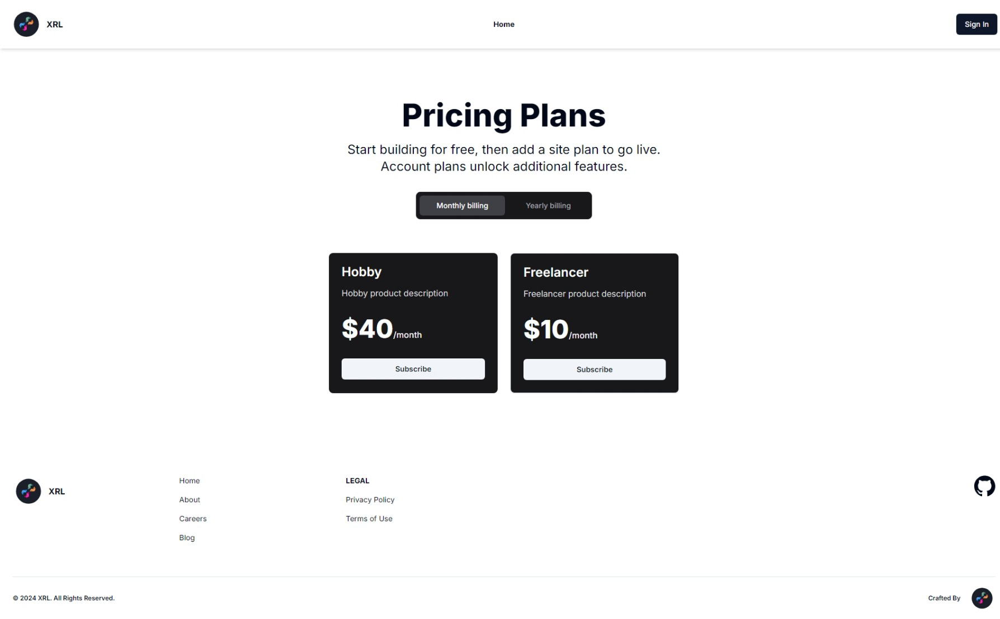
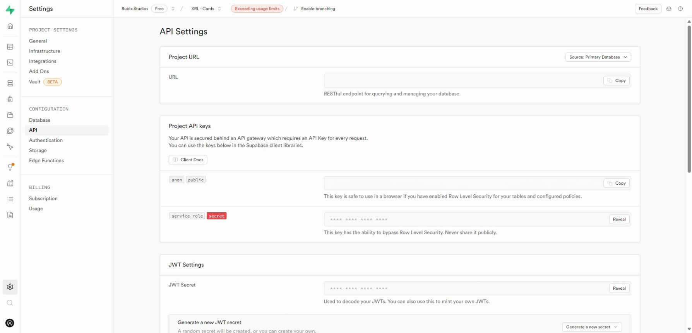
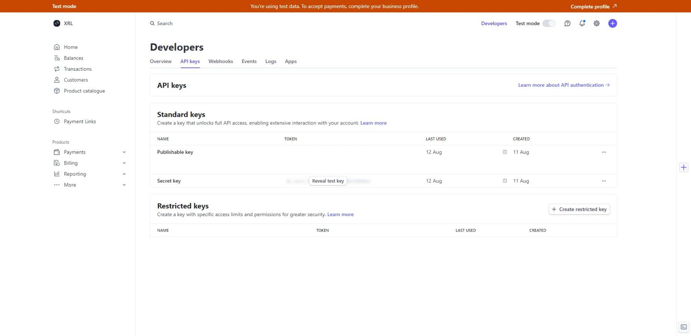

# XRL NextJS - Supabase - Stripe Boilerplate

This boilerplate provides the base for using NextJS with Supabase Auth and Stripe.  
This is a functional stripe integrated boilerplate.




## Features

- Secure user management and authentication with Supabase
- Powerful data access & management tooling on top of PostgreSQL with Supabase
- Integration with Stripe Checkout and the Stripe customer portal
- Automatic syncing of pricing plans and subscription statuses via Stripe webhooks

## Architecture

- NextJS 14
- Supabase
- Supabase Auth
- Simple Icons
- Stripe
- Shadcnui

### Recommended Tools

For optimal use of this boilerplate, it's recommended to use the following CLI tools:

- [Scoop CLI](https://scoop.sh/)
- [npm CLI](https://www.npmjs.com/)
- [Stripe CLI](https://stripe.com/docs/stripe-cli)
- [Supabase CLI](https://supabase.com/docs/guides/cli)

This boilerplate was built based off "Next.js Subscription Payments Starter" and has been updated to use the latest packages. Vercel has been removed from the coding setup as the project can be deployed on any available Node hosting.

- [Rubix Host](https://www.rubixhost.com.au): Affordable hosting for NodeJS.

## Basic Steps to Setup

1. **Download or fork the current package.**
2. **Create and deploy your Supabase database:**
   - Follow the instructions on the [Supabase website](https://supabase.com/docs/guides/getting-started) to create a new project.
   - Deploy the database by running `npx supabase db push` (see detailed instructions below).
3. **Run `npm install` to install all dependencies.**
4. **Rename `.env.local.example` and `.env.example` to `.env.local` and `.env`, respectively.**
5. **Navigate to [Auth > URL Configuration](https://app.supabase.com/project/_/auth/url-configuration) in the Supabase dashboard:**
   - Update the URLs to match your local or production environment.
6. **Adjust your `.env.local` file with the following variables:**

    ```plaintext
    NEXT_PUBLIC_SITE_URL= # Set to `http://localhost:3000` for local hosting or your site's URL.
    NEXT_PUBLIC_SUPABASE_URL= # Set to the "Project URL" from the Supabase dashboard.
    NEXT_PUBLIC_SUPABASE_ANON_KEY= # Set to the "anon" key found under "Project API keys" in Supabase.
    SUPABASE_SERVICE_ROLE_KEY= # Set to the "service_role" key found under "Project API keys" in Supabase.
    ```

    

7. **Set up the Supabase database:**

    You have two options:

    - **Option 1: Manual SQL Editor Setup**
        - Navigate to the [SQL Editor](https://supabase.com/dashboard/project/_/sql/new) in Supabase and copy the contents from the `app/supabase/migrations` file.

    - **Option 2: Using Supabase CLI**
        1. Move to the project's directory: `cd (folder-name)`
        2. Run `npx supabase init` to initialize the Supabase project locally.
        3. Run `npx supabase login` to authenticate with your Supabase account.
        4. Run `npx supabase link` and select the database you wish to link.
        5. Run `npx supabase db push` to apply the migration files and set up the database.

8. **Set up your Stripe account:**

    1. **Using the developer test account:**

        

        ```plaintext
        NEXT_PUBLIC_STRIPE_PUBLISHABLE_KEY= # Set to the Stripe "Publishable key" found in your Stripe dashboard.
        STRIPE_SECRET_KEY= # Set to the Stripe "Secret key" found in your Stripe dashboard.
        ```

    2. **Set up Stripe webhooks:**

        - Your webhook endpoint should be `<http://localhost:3000/api/webhooks>` for local development or adjust according to your production URL.
        - For more information on using Stripe CLI, see [Stripe CLI documentation](https://stripe.com/docs/stripe-cli).
        - To utilize the test products, run: `stripe fixtures fixtures/stripe-fixtures.json`.

    3. Ensure `STRIPE_WEBHOOK_SECRET` is set in your `.env` file, either by obtaining it via the Stripe CLI or through the online interface.

9. **Run `npm run dev` to start your project.**

### Troubleshooting

If your products do not appear in your Supabase database for test products, adjust the prices on Stripe and save to ensure the products propagate to Supabase.

## Learn More

To learn more about XRL, explore the following resources:

- [XRL Website](https://xrl.au/): Learn more about XRL, our goals, and our values.
- [Rubix Studios](https://www.rubixstudios.com.au): Discover more about Rubix Studios, the company behind XRL and its innovative technologies.

## Join the Community

Join our community to stay updated and collaborate with other developers.
